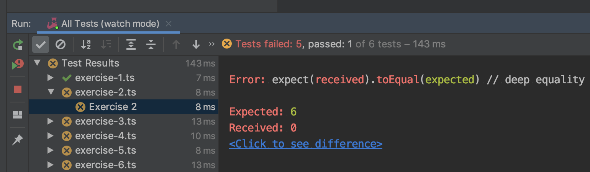

# Redux Saga Training


This training a is meant to be given as an interactive workshop that can be finished in an afternoon. Every page ends with an exercise to test if you understand the explained concept.

You can do those exercises in your own editor.

```bash
# clone
mkdir -p ~/code/training && cd ~/code/training
git clone https://github.com/flock-community/redux-saga-exercises && redux-saga-exercises

# install deps
npm i
```

Solve the exercises one-by-one until all the tests are green. You can trigger a test run by:

```bash
# all tests
npx jest

# interactive watch mode on changed files
npx jest --watch
```

There are also shared run configuration included in the repo for Jetbrain editors.



